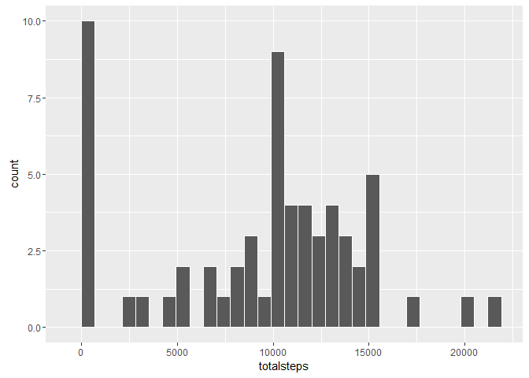
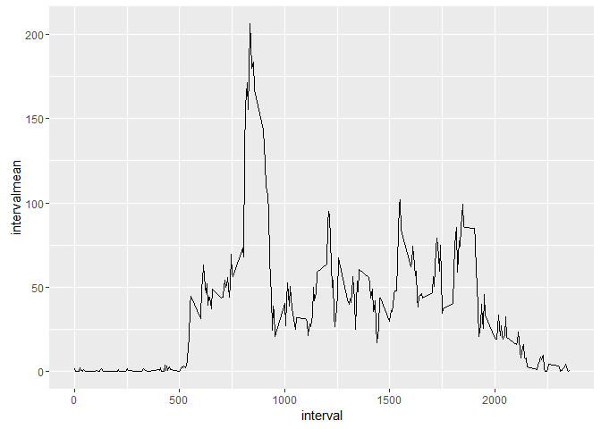
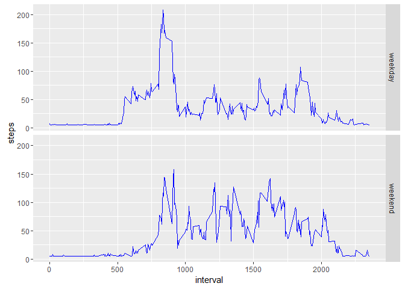

# Reproducible Research: Peer Assessment 1
Jason Tan Ming Jie  

## Required Packages

```r
library(dplyr)
```

```
## 
## Attaching package: 'dplyr'
```

```
## The following objects are masked from 'package:stats':
## 
##     filter, lag
```

```
## The following objects are masked from 'package:base':
## 
##     intersect, setdiff, setequal, union
```

```r
library(ggplot2)
library(lubridate)
```
  
## Loading and Preprocessing Data

```r
activity <- read.csv(unzip("RepData_PeerAssessment1/activity.zip"), stringsAsFactors = F)
date <- ymd(activity$date)
activity$date <- date
```

## What is the average daily activity pattern?

1. Total number of steps

```r
totalsteps <- activity %>%
  group_by(date) %>%
  summarise(totalsteps = sum(steps, na.rm = T)) %>%
  print
```

```
## Source: local data frame [61 x 2]
## 
##          date totalsteps
##        (time)      (int)
## 1  2012-10-01          0
## 2  2012-10-02        126
## 3  2012-10-03      11352
## 4  2012-10-04      12116
## 5  2012-10-05      13294
## 6  2012-10-06      15420
## 7  2012-10-07      11015
## 8  2012-10-08          0
## 9  2012-10-09      12811
## 10 2012-10-10       9900
## ..        ...        ...
```

2. Histogram

```r
ggplot(totalsteps, aes(x = totalsteps)) + geom_histogram(col = "white")
```

```
## `stat_bin()` using `bins = 30`. Pick better value with `binwidth`.
```



3. Mean and Median 

```r
averagesteps <- activity %>%
  group_by(date) %>%
  summarise(mean = mean(steps, na.rm = T), median = median(steps, na.rm = T)) %>%
  print
```

```
## Source: local data frame [61 x 3]
## 
##          date     mean median
##        (time)    (dbl)  (dbl)
## 1  2012-10-01       NA     NA
## 2  2012-10-02  0.43750      0
## 3  2012-10-03 39.41667      0
## 4  2012-10-04 42.06944      0
## 5  2012-10-05 46.15972      0
## 6  2012-10-06 53.54167      0
## 7  2012-10-07 38.24653      0
## 8  2012-10-08      NaN     NA
## 9  2012-10-09 44.48264      0
## 10 2012-10-10 34.37500      0
## ..        ...      ...    ...
```


## What is the average daily pattern?

1. Time Series

```r
dailysteps <- activity %>%
  group_by(interval) %>%
  summarise(intervalmean = mean(steps, na.rm = T))

ggplot(dailysteps, aes(x = interval, y = intervalmean)) + geom_line()
```



2. Max Steps

```r
dailysteps[which.max(dailysteps$intervalmean),1]
```

```
## Source: local data frame [1 x 1]
## 
##   interval
##      (int)
## 1      835
```


## Imputting missing values

1. Number of NAs

```r
sum(is.na(activity$steps))
```

```
## [1] 2304
```

2. Filling in the NA (using overall mean)

```r
activity$steps[is.na(activity$steps)] <- mean(activity$steps, na.rm = T)
```


## Are there differences in activity patterns between weekdays and weekends?

1. New Variable (Weekday or Weekend)

```r
activity$dayofweek <- wday(activity$date)
activity$daytype[activity$dayofweek <=6 | activity$dayofweek >= 2] <- "weekday"
activity$daytype[activity$dayofweek == 1 | activity$dayofweek == 7 ] <- "weekend"
activity$daytype <- as.factor(activity$daytype)
```

2. Time Series Plot

```r
daysteps <- activity %>%
  group_by(daytype, interval) %>%
  summarise(steps = mean(steps))

ggplot(daysteps, aes(x = interval, y = steps)) + geom_line(col = "blue") + facet_grid(daytype ~ .)
```


